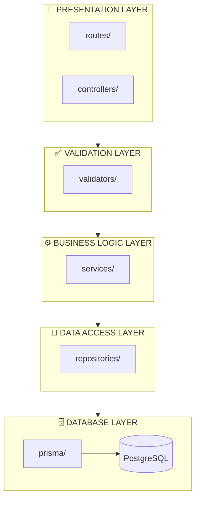
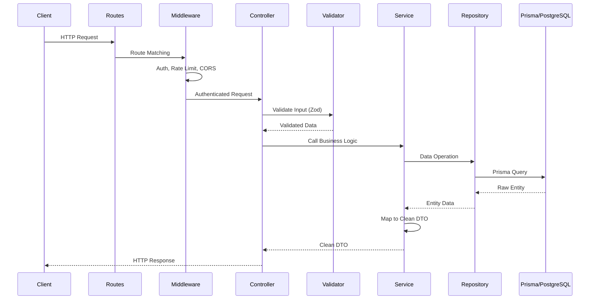
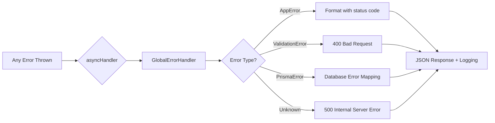
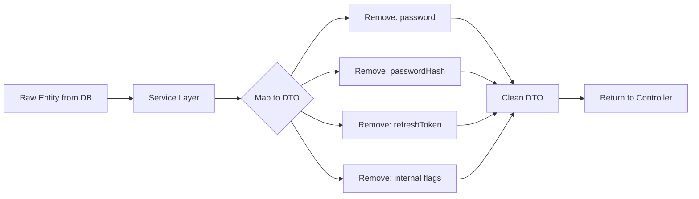

# Backend Architecture

> **Learning Management System (LMS)**  
> Architecture Pattern: **Layered Architecture**  
> Technology Stack: **Express.js + TypeScript + Prisma + PostgreSQL**

---

## Table of Contents

1. [Layer Overview](#layer-overview)
2. [Request Flow](#request-flow)
3. [Layer Responsibilities](#layer-responsibilities)
4. [Cross-Cutting Concerns](#cross-cutting-concerns)
5. [Data Flow & Security](#data-flow--security)
6. [Directory Structure](#directory-structure)
7. [Key Principles](#key-principles)

---

## Layer Overview

The architecture follows a strict **Layered Architecture** pattern, ensuring separation of concerns and maintainability.



---

## Request Flow

Every HTTP request follows a predictable, unidirectional flow through the architecture layers:



---

## Layer Responsibilities

### 1. Presentation Layer

| Directory | Purpose |
|-----------|---------|
| `routes/` | Define API endpoints, HTTP method mapping, and route-level middleware |
| `controllers/` | Handle HTTP request/response, delegate to services, format responses |

**Key Rules:**
- Controllers are **thin** — they should NOT contain business logic
- Controllers use `asyncHandler` wrapper to forward errors to the global error handler
- Response formatting uses standardized utility functions

---

### 2. Validation Layer

| Directory | Purpose |
|-----------|---------|
| `validators/` | Define **Zod schemas** for request body, query params, and path params |

**Key Rules:**
- All user input MUST be validated before reaching business logic
- Schemas are reusable and composable
- Validation errors return `400 Bad Request` with detailed error messages

---

### 3. Business Logic Layer

| Directory | Purpose |
|-----------|---------|
| `services/` | Core business logic, orchestration, domain rules, data transformation |

**Key Rules:**
- Services are the **only layer** that contains business logic
- Services must **NEVER** access Prisma directly — use repositories
- Services map raw database entities to **Clean DTOs** before returning

> [!IMPORTANT]
> **Data Security Rule:** Services must strip sensitive fields (e.g., `password`, `passwordHash`, `refreshToken`) from entities before returning data to controllers. Use mapper functions or explicit field selection.

---

### 4. Data Access Layer (Repository Pattern)

| Directory | Purpose |
|-----------|---------|
| `repositories/` | Database operations via Prisma, query composition, data persistence |

**Key Rules:**
- Repositories are the **ONLY** entry point to the database
- No other layer should import or use `PrismaClient` directly
- Repositories return raw Prisma entities — transformation happens in services

> [!CAUTION]
> **Strict Repository Pattern:** Direct Prisma access outside of `repositories/` is a violation of the architecture. This ensures all database logic remains centralized and testable.

---

### 5. Database Layer

| Directory | Purpose |
|-----------|---------|
| `prisma/` | Schema definition, migrations, seeding, PostgreSQL connection |

**Key Files:**
- `schema.prisma` — Database model definitions
- `migrations/` — Version-controlled schema changes

---

## Cross-Cutting Concerns

These components span multiple layers and provide essential infrastructure.

### Middleware Layer

| File | Purpose |
|------|---------|
| `auth.middleware.ts` | JWT authentication, token verification |
| `role.middleware.ts` | Role-based access control (RBAC) |
| `validate.middleware.ts` | Request validation using Zod schemas |
| `rateLimiter.middleware.ts` | API rate limiting protection |
| `error.middleware.ts` | **Global Error Handler** — catches and formats all errors |

---

### Infrastructure Utilities

| File | Purpose |
|------|---------|
| `AppError.ts` | Custom error class with HTTP status codes and error types |
| `ApiError.ts` | Standardized API error response formatting |
| `asyncHandler.ts` | Wrapper for async route handlers to auto-catch errors |
| `logger.ts` | **Winston Logger** — structured logging with daily rotation |
| `response.ts` | Standardized API response helpers |
| `jwt.ts` | JWT token generation and verification utilities |
| `password.ts` | Password hashing and comparison utilities |

---

### Global Error Handler

The `GlobalErrorHandler` middleware (`error.middleware.ts`) provides centralized error handling:



**Features:**
- Catches all unhandled errors from async handlers
- Maps error types to appropriate HTTP status codes
- Logs errors with Winston (including stack traces in development)
- Returns consistent JSON error responses

---

### Winston Logger

Structured logging implementation with the following features:

- **Log Levels:** `error`, `warn`, `info`, `http`, `debug`
- **Transports:** Console (colorized) + Daily rotating file
- **Metadata:** Timestamp, correlation ID, request context
- **Output Files:** `logs/application-%DATE%.log`, `logs/error-%DATE%.log`

---

## Data Flow & Security

### Entity to DTO Mapping

Raw database entities may contain sensitive information. Services must transform these into **Clean DTOs** before returning:



**Example Transformation:**

```typescript
// ❌ BAD: Returning raw entity
return user; // Contains passwordHash!

// ✅ GOOD: Returning clean DTO
const { password, refreshToken, ...userDto } = user;
return userDto;
```

---

## Directory Structure

```
backend/
├── src/
│   ├── app.ts                    # Express app configuration
│   ├── server.ts                 # Server entry point
│   │
│   ├── config/                   # ⚙️ Configuration layer
│   │   ├── database.ts           #    Prisma client instance
│   │   ├── swagger.ts            #    Swagger/OpenAPI setup
│   │   └── index.ts              #    Config exports
│   │
│   ├── constants/                # 📌 Application constants
│   │   └── index.ts              #    Enums, static values
│   │
│   ├── controllers/              # 🎯 Presentation layer
│   │   └── *.controller.ts       #    Request handlers
│   │
│   ├── middlewares/              # 🛡️ Middleware layer
│   │   ├── auth.middleware.ts    #    JWT authentication
│   │   ├── role.middleware.ts    #    RBAC authorization
│   │   ├── validate.middleware.ts#    Input validation
│   │   ├── rateLimiter.middleware.ts  # Rate limiting
│   │   └── error.middleware.ts   #    Global error handler
│   │
│   ├── repositories/             # 💾 Data access layer
│   │   └── *.repository.ts       #    Prisma queries
│   │
│   ├── routes/                   # 🛣️ API routes
│   │   ├── index.ts              #    Route aggregator
│   │   └── *.routes.ts           #    Feature routes
│   │
│   ├── services/                 # ⚙️ Business logic layer
│   │   └── *.service.ts          #    Domain logic
│   │
│   ├── types/                    # 📝 TypeScript definitions
│   │   ├── index.ts              #    Type exports
│   │   └── *.types.ts            #    DTOs, interfaces
│   │
│   ├── utils/                    # 🔧 Utility functions
│   │   ├── AppError.ts           #    Custom error class
│   │   ├── ApiError.ts           #    API error formatter
│   │   ├── asyncHandler.ts       #    Async wrapper
│   │   ├── logger.ts             #    Winston logger
│   │   ├── response.ts           #    Response helpers
│   │   ├── jwt.ts                #    JWT utilities
│   │   └── password.ts           #    Password utilities
│   │
│   └── validators/               # ✅ Validation layer
│       └── *.validator.ts        #    Zod schemas
│
├── prisma/
│   ├── schema.prisma             # Database schema
│   └── migrations/               # Schema migrations
│
├── logs/                         # Application logs (generated)
├── docs/                         # Documentation
└── package.json                  # Dependencies
```

---

## Key Principles

### 1. Separation of Concerns
Each layer has a single, well-defined responsibility. Cross-layer dependencies only flow downward.

### 2. Dependency Rule
```
Routes → Controllers → Services → Repositories → Prisma
```
**Never reverse this flow.**

### 3. Error Handling
All errors are handled through a centralized `GlobalErrorHandler`. Use `asyncHandler` wrapper for all route handlers.

### 4. Data Security
Sensitive data is **never** exposed to the client. All entities pass through DTO transformation in the service layer.

### 5. Testability
The layered architecture enables easy unit testing:
- **Controllers:** Mock services
- **Services:** Mock repositories
- **Repositories:** Mock Prisma client

---

> **Document Version:** 1.0  
> **Last Updated:** January 2026  
> **Maintainer:** Backend Team
