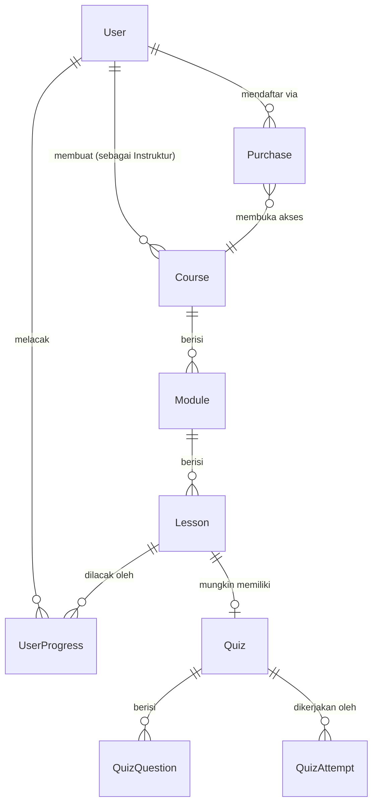
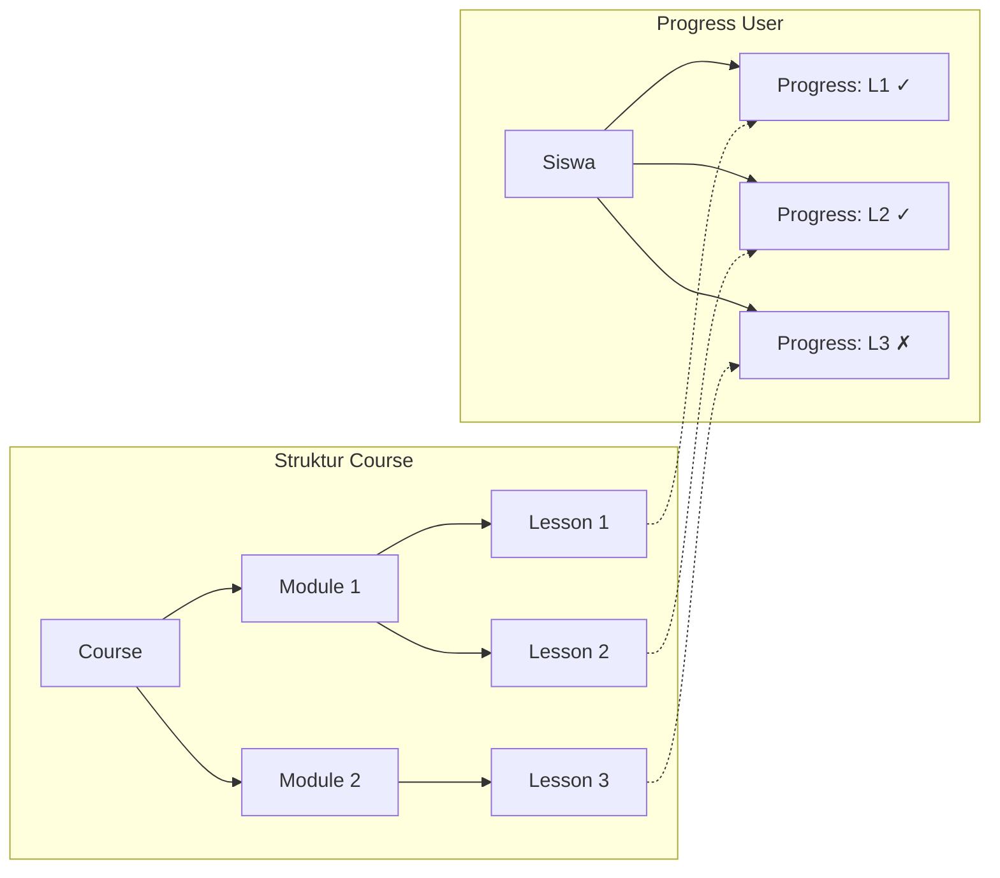

# Dokumentasi Skema Database LMS

> **Panduan Referensi Teknis**  
> Versi: 1.0 | Terakhir Diperbarui: Januari 2026  
> Stack: Express.js + PostgreSQL + Prisma ORM

---

## Daftar Isi

1. [Gambaran Relasi Entitas](#1-gambaran-relasi-entitas)
2. [Kamus Model Detail](#2-kamus-model-detail)
3. [Panduan Implementasi Fitur](#3-panduan-implementasi-fitur)
4. [Spesifik Prisma](#4-spesifik-prisma)

---

## 1. Gambaran Relasi Entitas

### 1.1 Hierarki Inti

LMS mengikuti struktur hierarkis yang ketat untuk konten kursus:



**Penjelasan Alur:**

| Level | Model | Tujuan |
|-------|-------|--------|
| 1 | `User` | Aktor (Admin, Instruktur, atau Siswa) |
| 2 | `Course` | Paket pembelajaran lengkap yang dibuat oleh Instruktur |
| 3 | `Module` | Bab/bagian dalam kursus (misal: "Minggu 1", "Pendahuluan") |
| 4 | `Lesson` | Konten individual (Video, Teks, atau Kuis) |
| 5 | `Quiz` | Penilaian yang terlampir pada pelajaran tipe QUIZ |

### 1.2 Alur Pendaftaran Siswa

Sistem pendaftaran menggunakan **model berbasis Pembelian** bukan tabel join sederhana. Desain ini menangkap data transaksional untuk analitik pendapatan.

```
Siswa ingin mengakses Course
        │
        ▼
┌───────────────────┐
│   Tabel Purchase  │  ◄── Menyimpan: userId, courseId, price, paymentId
└───────────────────┘
        │
        ▼
Siswa sekarang dapat mengakses semua Modules & Lessons
        │
        ▼
┌───────────────────┐
│  UserProgress     │  ◄── Melacak: pelajaran mana yang sudah selesai
└───────────────────┘
```

**Poin Penting:**
- `Purchase` berfungsi sebagai **catatan pendaftaran** DAN **catatan transaksi**
- Seorang siswa hanya dapat memiliki SATU pembelian per kursus (`@@unique([userId, courseId])`)
- Progress dilacak per-pelajaran, bukan per-modul atau per-kursus

### 1.3 Hubungan Pelacakan Progress



**Logika Perhitungan:**
- Total pelajaran dalam kursus = 3
- Pelajaran yang selesai (isCompleted = true) = 2
- **Progress = 2/3 = 66,67%**

---

## 2. Kamus Model Detail

### 2.1 User & Autentikasi

#### `User`

| Aspek | Detail |
|-------|--------|
| **Tujuan** | Tabel identitas sentral untuk semua aktor sistem |
| **Nama Tabel** | `users` |

**Field Utama:**

| Field | Tipe | Deskripsi |
|-------|------|-----------|
| `role` | Enum `Role` | Membedakan tipe user: `ADMIN`, `INSTRUCTOR`, `STUDENT` |
| `passwordHash` | `String` | Password yang di-hash dengan Bcrypt (JANGAN PERNAH simpan teks biasa) |
| `isActive` | `Boolean` | Flag soft-delete. Set ke `false` untuk menonaktifkan akun |
| `isVerified` | `Boolean` | Status verifikasi email |
| `lastLoginAt` | `DateTime?` | Melacak login terakhir untuk keamanan/analitik |

**Penjelasan Relasi:**

```typescript
// One-to-One: Hanya instruktur yang memiliki profil
instructorProfile InstructorProfile?

// One-to-Many: Seorang instruktur dapat membuat banyak kursus
courses Course[] @relation("InstructorCourses")

// One-to-Many: Seorang siswa dapat membeli banyak kursus
purchases Purchase[]

// One-to-Many: Seorang siswa melacak progress di banyak pelajaran
userProgress UserProgress[]
```

---

#### `InstructorProfile`

| Aspek | Detail |
|-------|--------|
| **Tujuan** | Data profil tambahan khusus untuk instruktur |
| **Nama Tabel** | `instructor_profiles` |
| **Mengapa Terpisah?** | Tidak semua user adalah instruktur. Ini menghindari kolom NULL di tabel User |

**Field Utama:**

| Field | Tipe | Deskripsi |
|-------|------|-----------|
| `expertise` | `String[]` | Array PostgreSQL untuk tag seperti `["JavaScript", "React", "Node.js"]` |
| `socialLinks` | `Json?` | Struktur fleksibel: `{ twitter: "url", linkedin: "url" }` |
| `totalStudents` | `Int` | **Counter denormalisasi** untuk pembacaan dashboard yang cepat |
| `totalRevenue` | `Decimal` | **Counter denormalisasi** - update via trigger atau logika aplikasi |
| `averageRating` | `Float` | **Denormalisasi** - hitung ulang ketika review berubah |

**Mengapa `onDelete: Cascade`?**
```prisma
user User @relation(fields: [userId], references: [id], onDelete: Cascade)
```
Jika User dihapus, InstructorProfile mereka otomatis terhapus. Ini menjaga integritas referensial tanpa record yatim.

---

### 2.2 Arsitektur Course

#### `Category`

| Aspek | Detail |
|-------|--------|
| **Tujuan** | Mengorganisir kursus ke dalam kategori yang dapat dijelajahi |
| **Nama Tabel** | `categories` |
| **Fitur Khusus** | Self-referencing untuk kategori bersarang |

**Field Utama:**

| Field | Tipe | Deskripsi |
|-------|------|-----------|
| `slug` | `String` | Identifier URL-friendly: `"web-development"` |
| `parentId` | `Int?` | Self-reference untuk hierarki (NULL = level teratas) |
| `position` | `Int` | Urutan tampilan dalam parent |

**Pola Self-Relation:**
```prisma
parent   Category?  @relation("CategoryHierarchy", fields: [parentId], references: [id], onDelete: SetNull)
children Category[] @relation("CategoryHierarchy")
```

**Contoh Hierarki:**
```
Pemrograman (parentId: null)
├── Web Development (parentId: 1)
│   ├── Frontend (parentId: 2)
│   └── Backend (parentId: 2)
└── Mobile Development (parentId: 1)
```

**Mengapa `onDelete: SetNull`?** Jika kategori parent dihapus, children menjadi kategori level teratas alih-alih dihapus.

---

#### `Course`

| Aspek | Detail |
|-------|--------|
| **Tujuan** | Produk utama - paket pembelajaran lengkap |
| **Nama Tabel** | `courses` |

**Field Utama:**

| Field | Tipe | Deskripsi |
|-------|------|-----------|
| `slug` | `String` | Path URL: `/courses/react-masterclass` |
| `status` | `CourseStatus` | Status workflow: `DRAFT` → `PENDING_REVIEW` → `PUBLISHED` → `ARCHIVED` |
| `level` | `CourseLevel` | Tingkat kesulitan: `BEGINNER`, `INTERMEDIATE`, `ADVANCED`, `ALL_LEVELS` |
| `price` | `Decimal(10,2)` | Harga kursus dengan presisi 2 desimal |
| `discountPrice` | `Decimal?` | Harga diskon (NULL = tidak ada diskon) |
| `requirements` | `String[]` | Prasyarat: `["JavaScript Dasar", "HTML/CSS"]` |
| `whatYouWillLearn` | `String[]` | Hasil pembelajaran untuk halaman kursus |
| `totalDuration` | `Int` | **Denormalisasi** - jumlah semua durasi pelajaran (detik) |
| `totalStudents` | `Int` | **Denormalisasi** - jumlah pembelian |
| `isFeatured` | `Boolean` | Untuk highlight homepage/marketing |

**Workflow Enum Status:**
```
DRAFT ──────► PENDING_REVIEW ──────► PUBLISHED
  │                                      │
  │                                      ▼
  └──────────────────────────────► ARCHIVED
```

**Mengapa `onDelete: Cascade` pada instructor?**
```prisma
instructor User @relation("InstructorCourses", fields: [instructorId], references: [id], onDelete: Cascade)
```
Jika akun instruktur dihapus, semua kursus mereka dihapus. Ini adalah keputusan bisnis - ubah ke `SetNull` jika Anda ingin mempertahankan kursus.

---

#### `Module`

| Aspek | Detail |
|-------|--------|
| **Tujuan** | Bab/bagian dalam kursus |
| **Nama Tabel** | `modules` |

**Field Utama:**

| Field | Tipe | Deskripsi |
|-------|------|-----------|
| `position` | `Int` | Urutan dalam kursus (0, 1, 2, ...) |
| `isPublished` | `Boolean` | Modul draft disembunyikan dari siswa |

**Contoh Struktur:**
```
Course: "React Masterclass"
├── Module 1 (position: 0): "Memulai"
├── Module 2 (position: 1): "Komponen & Props"
├── Module 3 (position: 2): "State Management"
└── Module 4 (position: 3): "Pola Lanjutan"
```

---

#### `Lesson`

| Aspek | Detail |
|-------|--------|
| **Tujuan** | Konten individual dalam modul |
| **Nama Tabel** | `lessons` |

**Field Utama:**

| Field | Tipe | Deskripsi |
|-------|------|-----------|
| `type` | `LessonType` | Format konten: `VIDEO`, `TEXT`, atau `QUIZ` |
| `content` | `Text?` | Markdown/HTML untuk pelajaran TEXT (NULL untuk VIDEO/QUIZ) |
| `videoUrl` | `String?` | URL video untuk pelajaran VIDEO |
| `duration` | `Int` | Durasi dalam detik |
| `position` | `Int` | Urutan dalam modul |
| `isFree` | `Boolean` | Pelajaran preview dapat diakses tanpa pembelian |
| `isPublished` | `Boolean` | Kontrol visibilitas |

**Penggunaan Berdasarkan Tipe:**

| LessonType | Menggunakan `content` | Menggunakan `videoUrl` | Menggunakan relasi `quiz` |
|------------|----------------------|------------------------|---------------------------|
| `VIDEO` | ✗ | ✓ | ✗ |
| `TEXT` | ✓ | ✗ | ✗ |
| `QUIZ` | ✗ | ✗ | ✓ |

---

#### `MuxData`

| Aspek | Detail |
|-------|--------|
| **Tujuan** | Menyimpan metadata streaming video Mux.com |
| **Nama Tabel** | `mux_data` |
| **Mengapa Terpisah?** | Mengisolasi data integrasi pihak ketiga dari model lesson inti |

**Field Utama:**

| Field | Tipe | Deskripsi |
|-------|------|-----------|
| `assetId` | `String` | Identifier aset Mux |
| `playbackId` | `String?` | Digunakan untuk membuat URL streaming |
| `status` | `String?` | Status pemrosesan: `"preparing"`, `"ready"`, `"errored"` |

---

#### `Attachment`

| Aspek | Detail |
|-------|--------|
| **Tujuan** | Resource yang dapat diunduh untuk kursus |
| **Nama Tabel** | `attachments` |

**Field Utama:**

| Field | Tipe | Deskripsi |
|-------|------|-----------|
| `url` | `String` | URL download (S3, CloudFlare, dll.) |
| `size` | `Int?` | Ukuran file dalam byte untuk tampilan UI |
| `mimeType` | `String?` | Tipe file: `"application/pdf"`, `"image/png"` |
| `position` | `Int` | Urutan tampilan |

---

### 2.3 Sistem Kuis

#### `Quiz`

| Aspek | Detail |
|-------|--------|
| **Tujuan** | Konfigurasi penilaian untuk pelajaran tipe QUIZ |
| **Nama Tabel** | `quizzes` |
| **Relasi** | One-to-One dengan Lesson (`lessonId` adalah `@unique`) |

**Field Utama:**

| Field | Tipe | Deskripsi |
|-------|------|-----------|
| `passingScore` | `Int` | % minimum untuk lulus (default: 70) |
| `timeLimitMinutes` | `Int?` | NULL = waktu tidak terbatas |
| `allowRetake` | `Boolean` | Apakah siswa bisa mencoba ulang setelah gagal? |
| `maxAttempts` | `Int?` | NULL = percobaan tidak terbatas |
| `shuffleQuestions` | `Boolean` | Acak urutan pertanyaan setiap percobaan |

---

#### `QuizQuestion`

| Aspek | Detail |
|-------|--------|
| **Tujuan** | Pertanyaan individual dalam kuis |
| **Nama Tabel** | `quiz_questions` |

**Field Utama:**

| Field | Tipe | Deskripsi |
|-------|------|-----------|
| `question` | `Text` | Teks pertanyaan |
| `options` | `Json` | Struktur opsi fleksibel (lihat di bawah) |
| `explanation` | `Text?` | Ditampilkan setelah menjawab (untuk pembelajaran) |
| `points` | `Int` | Nilai poin (default: 1) |
| `position` | `Int` | Urutan pertanyaan |

**Struktur JSON Options:**
```json
[
  { "id": "a", "text": "JavaScript", "isCorrect": false },
  { "id": "b", "text": "TypeScript", "isCorrect": true },
  { "id": "c", "text": "CoffeeScript", "isCorrect": false },
  { "id": "d", "text": "ActionScript", "isCorrect": false }
]
```

> **Mengapa JSON bukan tabel terpisah?**  
> Opsi sangat terkait erat dengan pertanyaan dan jarang di-query secara independen. JSON menyederhanakan model data dan meningkatkan performa baca untuk rendering kuis.

---

#### `QuizAttempt`

| Aspek | Detail |
|-------|--------|
| **Tujuan** | Catatan siswa mengerjakan kuis |
| **Nama Tabel** | `quiz_attempts` |

**Field Utama:**

| Field | Tipe | Deskripsi |
|-------|------|-----------|
| `score` | `Int` | Poin yang diperoleh |
| `totalPoints` | `Int` | Poin maksimum yang mungkin |
| `percentage` | `Float` | Dihitung: `(score / totalPoints) * 100` |
| `isPassed` | `Boolean` | `percentage >= quiz.passingScore` |
| `startedAt` | `DateTime` | Kapan percobaan dimulai |
| `completedAt` | `DateTime?` | NULL = sedang berlangsung |
| `timeTaken` | `Int?` | Durasi dalam detik |

---

#### `QuizAttemptAnswer`

| Aspek | Detail |
|-------|--------|
| **Tujuan** | Jawaban individual dalam percobaan |
| **Nama Tabel** | `quiz_attempt_answers` |

**Field Utama:**

| Field | Tipe | Deskripsi |
|-------|------|-----------|
| `selectedOption` | `String` | ID opsi yang dipilih (misal: `"b"`) |
| `isCorrect` | `Boolean` | Apakah jawabannya benar? |
| `pointsEarned` | `Int` | Poin untuk jawaban ini |

---

### 2.4 Keterlibatan Siswa

#### `Purchase`

| Aspek | Detail |
|-------|--------|
| **Tujuan** | Catatan pendaftaran + catatan transaksi |
| **Nama Tabel** | `purchases` |

**Field Utama:**

| Field | Tipe | Deskripsi |
|-------|------|-----------|
| `price` | `Decimal(10,2)` | Harga aktual yang dibayar (mungkin berbeda dari harga kursus) |
| `currency` | `String` | Kode ISO: `"USD"`, `"EUR"`, `"IDR"` |
| `paymentMethod` | `String?` | `"stripe"`, `"paypal"`, `"manual"` |
| `paymentId` | `String?` | Referensi eksternal (Stripe PaymentIntent ID, dll.) |
| `status` | `String` | `"pending"`, `"completed"`, `"refunded"` |
| `refundedAt` | `DateTime?` | Kapan refund diproses |

**Mengapa `@@unique([userId, courseId])`?**
Seorang siswa hanya dapat membeli kursus sekali. Ini mencegah pendaftaran duplikat dan menyederhanakan pengecekan akses.

---

#### `UserProgress`

| Aspek | Detail |
|-------|--------|
| **Tujuan** | Melacak progress siswa melalui pelajaran |
| **Nama Tabel** | `user_progress` |

**Field Utama:**

| Field | Tipe | Deskripsi |
|-------|------|-----------|
| `isCompleted` | `Boolean` | Apakah pelajaran sudah selesai sepenuhnya? |
| `watchTime` | `Int` | Detik yang ditonton (untuk analitik video) |
| `completedAt` | `DateTime?` | Timestamp penyelesaian |

**Mengapa `@@unique([userId, lessonId])`?**
Satu catatan progress per siswa per pelajaran. Gunakan `upsert` untuk create-or-update.

---

#### `Review`

| Aspek | Detail |
|-------|--------|
| **Tujuan** | Rating dan feedback siswa |
| **Nama Tabel** | `reviews` |

**Field Utama:**

| Field | Tipe | Deskripsi |
|-------|------|-----------|
| `rating` | `Int` | 1-5 bintang |
| `title` | `String?` | Ringkasan singkat |
| `comment` | `Text?` | Feedback detail |
| `isVisible` | `Boolean` | Flag moderasi (sembunyikan review tidak pantas) |

**Mengapa `@@unique([userId, courseId])`?**
Satu review per siswa per kursus. Untuk update, gunakan `upsert`.

---

### 2.5 Sistem

#### `Notification`

| Aspek | Detail |
|-------|--------|
| **Tujuan** | Notifikasi dalam aplikasi |
| **Nama Tabel** | `notifications` |

**Field Utama:**

| Field | Tipe | Deskripsi |
|-------|------|-----------|
| `type` | `String` | Kategori: `"course_update"`, `"new_lesson"`, `"quiz_result"`, `"system"` |
| `data` | `Json?` | Payload kontekstual: `{ courseId: 5, lessonId: 12 }` |
| `isRead` | `Boolean` | Status dibaca/belum dibaca |

---

#### `SystemSetting`

| Aspek | Detail |
|-------|--------|
| **Tujuan** | Penyimpanan key-value untuk konfigurasi aplikasi |
| **Nama Tabel** | `system_settings` |

**Contoh Penggunaan:**
```json
{ "key": "platform_fee_percentage", "value": 10 }
{ "key": "featured_course_ids", "value": [1, 5, 12] }
{ "key": "maintenance_mode", "value": false }
```

---

## 3. Panduan Implementasi Fitur

### 3.1 Pengurutan Modules & Lessons

Baik `Module` maupun `Lesson` memiliki field `position` untuk pengurutan.

**Query modules berurutan:**
```typescript
const modules = await prisma.module.findMany({
  where: { courseId: 5 },
  orderBy: { position: 'asc' },
  include: {
    lessons: {
      orderBy: { position: 'asc' }
    }
  }
});
```

**Pengurutan ulang (drag-and-drop):**
```typescript
// Update posisi secara bulk
await prisma.$transaction(
  newOrder.map((id, index) =>
    prisma.module.update({
      where: { id },
      data: { position: index }
    })
  )
);
```

**Best Practice:** Gunakan jarak dalam posisi (0, 10, 20) untuk memungkinkan penyisipan tanpa mengurutkan ulang semuanya.

---

### 3.2 Perhitungan Progress

Untuk menghitung statistik dashboard "40% Selesai":

```typescript
async function getCourseProgress(userId: number, courseId: number) {
  // Dapatkan jumlah total pelajaran untuk kursus
  const totalLessons = await prisma.lesson.count({
    where: {
      module: { courseId },
      isPublished: true
    }
  });

  // Dapatkan jumlah pelajaran yang selesai untuk user ini
  const completedLessons = await prisma.userProgress.count({
    where: {
      userId,
      isCompleted: true,
      lesson: {
        module: { courseId },
        isPublished: true
      }
    }
  });

  const percentage = totalLessons > 0 
    ? Math.round((completedLessons / totalLessons) * 100) 
    : 0;

  return { totalLessons, completedLessons, percentage };
}
```

**Alternatif: Query Tunggal dengan Agregasi**
```typescript
const result = await prisma.lesson.findMany({
  where: {
    module: { courseId },
    isPublished: true
  },
  select: {
    id: true,
    userProgress: {
      where: { userId, isCompleted: true },
      select: { id: true }
    }
  }
});

const total = result.length;
const completed = result.filter(l => l.userProgress.length > 0).length;
const percentage = Math.round((completed / total) * 100);
```

---

### 3.3 Manajemen Role

Enum `Role` menyediakan tiga tipe user yang berbeda:

```typescript
// Contoh middleware
function requireRole(...roles: Role[]) {
  return (req, res, next) => {
    if (!roles.includes(req.user.role)) {
      return res.status(403).json({ error: 'Terlarang' });
    }
    next();
  };
}

// Penggunaan
router.get('/admin/users', requireRole('ADMIN'), getUsers);
router.post('/courses', requireRole('INSTRUCTOR', 'ADMIN'), createCourse);
router.post('/enroll', requireRole('STUDENT'), enrollCourse);
```

**Matriks Akses Berbasis Role:**

| Fitur | ADMIN | INSTRUCTOR | STUDENT |
|-------|-------|------------|---------|
| Kelola semua user | ✓ | ✗ | ✗ |
| Buat kursus | ✓ | ✓ | ✗ |
| Edit kursus sendiri | ✓ | ✓ | ✗ |
| Lihat semua kursus | ✓ | ✗ | ✗ |
| Beli kursus | ✗ | ✗ | ✓ |
| Lacak progress | ✗ | ✗ | ✓ |
| Berikan review | ✗ | ✗ | ✓ |

**Pengecekan Kepemilikan Kursus:**
```typescript
async function canEditCourse(userId: number, courseId: number, role: Role) {
  if (role === 'ADMIN') return true;
  
  const course = await prisma.course.findUnique({
    where: { id: courseId },
    select: { instructorId: true }
  });
  
  return course?.instructorId === userId;
}
```

---

### 3.4 Query Analitik Dashboard

#### Total Siswa per Kursus (Dashboard Instruktur)
```typescript
const courseStats = await prisma.course.findMany({
  where: { instructorId: userId },
  select: {
    id: true,
    title: true,
    totalStudents: true, // Field denormalisasi
    _count: {
      select: { purchases: true } // Atau hitung dinamis
    }
  }
});
```

#### Total Pendapatan (Dashboard Instruktur)
```typescript
const revenue = await prisma.purchase.aggregate({
  where: {
    course: { instructorId: userId },
    status: 'completed'
  },
  _sum: { price: true }
});

console.log(revenue._sum.price); // Decimal
```

#### Pendapatan per Bulan (Data Chart)
```typescript
const monthlyRevenue = await prisma.$queryRaw`
  SELECT 
    DATE_TRUNC('month', created_at) as month,
    SUM(price) as total
  FROM purchases
  WHERE course_id IN (
    SELECT id FROM courses WHERE instructor_id = ${userId}
  )
  AND status = 'completed'
  GROUP BY DATE_TRUNC('month', created_at)
  ORDER BY month DESC
  LIMIT 12
`;
```

#### Tingkat Penyelesaian Kursus
```typescript
async function getCompletionRate(courseId: number) {
  const totalLessons = await prisma.lesson.count({
    where: { module: { courseId }, isPublished: true }
  });

  const studentsWithProgress = await prisma.purchase.findMany({
    where: { courseId },
    select: {
      userId: true,
      user: {
        select: {
          userProgress: {
            where: {
              isCompleted: true,
              lesson: { module: { courseId } }
            }
          }
        }
      }
    }
  });

  const completionRates = studentsWithProgress.map(s => ({
    userId: s.userId,
    percentage: Math.round((s.user.userProgress.length / totalLessons) * 100)
  }));

  const avgCompletion = completionRates.reduce((sum, s) => sum + s.percentage, 0) 
    / completionRates.length || 0;

  return { totalStudents: completionRates.length, avgCompletion };
}
```

---

## 4. Spesifik Prisma

### 4.1 Direktif `@relation`

Mendefinisikan bagaimana model terhubung. Penting untuk include yang type-safe dari Prisma.

```prisma
// Relasi bernama (diperlukan ketika ada beberapa relasi antara model yang sama)
courses Course[] @relation("InstructorCourses")

// Relasi standar dengan cascade
course Course @relation(fields: [courseId], references: [id], onDelete: Cascade)
```

**Opsi `onDelete`:**

| Opsi | Perilaku |
|------|----------|
| `Cascade` | Hapus record terkait ketika parent dihapus |
| `SetNull` | Set foreign key ke NULL (field harus optional) |
| `Restrict` | Cegah penghapusan jika record terkait ada |
| `NoAction` | Default database (biasanya sama dengan Restrict) |

---

### 4.2 Direktif `@@index`

Membuat index database untuk query yang lebih cepat.

```prisma
@@index([courseId])           // Index kolom tunggal
@@index([userId, quizId])     // Index komposit
@@index([status, createdAt])  // Untuk query terfilter + terurut
```

**Kapan Menambahkan Index:**
- Foreign keys (Prisma tidak auto-index ini di PostgreSQL)
- Field yang digunakan dalam klausa `WHERE`
- Field yang digunakan dalam `ORDER BY`
- Field yang digunakan dalam kondisi `JOIN`

**Index dalam Skema Ini:**

| Tabel | Index | Tujuan |
|-------|-------|--------|
| `users` | `email` | Lookup login |
| `users` | `role` | Filter berbasis role |
| `courses` | `slug` | Lookup URL SEO |
| `courses` | `status` | Filter berdasarkan status publikasi |
| `courses` | `isFeatured` | Query homepage |
| `purchases` | `createdAt` | Time-series pendapatan |
| `user_progress` | `isCompleted` | Perhitungan progress |

---

### 4.3 Direktif `@@unique`

Menegakkan keunikan di level database dan mengaktifkan operasi `upsert`.

```prisma
@@unique([userId, courseId])  // Constraint unique komposit
```

**Penggunaan dengan Upsert:**
```typescript
await prisma.userProgress.upsert({
  where: {
    userId_lessonId: { userId: 1, lessonId: 5 }  // Nama yang auto-generated
  },
  update: { isCompleted: true, completedAt: new Date() },
  create: { userId: 1, lessonId: 5, isCompleted: true, completedAt: new Date() }
});
```

---

### 4.4 Direktif `@map` dan `@@map`

Mengontrol penamaan database sambil menjaga model Prisma tetap TypeScript-friendly.

```prisma
firstName String @map("first_name")  // Kolom: first_name, Field: firstName
@@map("users")                        // Tabel: users, Model: User
```

**Manfaat:**
- Database menggunakan `snake_case` (konvensi PostgreSQL)
- TypeScript menggunakan `camelCase` (konvensi JavaScript)
- Response API bersih tanpa transformasi

---

### 4.5 Direktif `@db`

Menentukan tipe kolom spesifik PostgreSQL.

```prisma
bio         String?  @db.Text          // TEXT bukan VARCHAR
price       Decimal  @db.Decimal(10,2) // DECIMAL(10,2) untuk uang
totalRevenue Decimal @db.Decimal(12,2) // Presisi lebih besar untuk total
```

**Mapping Tipe PostgreSQL:**

| Prisma | Tipe PG Default | Dengan @db |
|--------|-----------------|------------|
| `String` | `VARCHAR(191)` | `@db.Text` → `TEXT` |
| `Decimal` | `DECIMAL(65,30)` | `@db.Decimal(10,2)` → `DECIMAL(10,2)` |
| `String[]` | `TEXT[]` | Array PostgreSQL native |

---

### 4.6 Field JSON

Prisma memetakan tipe `Json` ke `JSONB` PostgreSQL.

```prisma
options     Json    // Opsi kuis
socialLinks Json?   // Media sosial instruktur
data        Json?   // Metadata notifikasi
```

**Query JSON:**
```typescript
// Filter berdasarkan field JSON (PostgreSQL)
const questions = await prisma.$queryRaw`
  SELECT * FROM quiz_questions 
  WHERE options @> '[{"isCorrect": true}]'
`;
```

---

### 4.7 Field Array

Array native PostgreSQL untuk list sederhana.

```prisma
expertise        String[]   // ["React", "Node.js"]
requirements     String[]   // ["Pengetahuan JS dasar"]
whatYouWillLearn String[]   // Hasil pembelajaran
```

**Query Array:**
```typescript
// Mengandung nilai
const courses = await prisma.course.findMany({
  where: {
    requirements: { has: 'JavaScript' }
  }
});

// Mengandung salah satu nilai
const instructors = await prisma.instructorProfile.findMany({
  where: {
    expertise: { hasSome: ['React', 'Vue'] }
  }
});
```

---

## Referensi Cepat: Pola Query Prisma

### Pengecekan Pendaftaran
```typescript
const isEnrolled = await prisma.purchase.findUnique({
  where: { userId_courseId: { userId, courseId } }
}) !== null;
```

### Buat Kursus dengan Modul
```typescript
const course = await prisma.course.create({
  data: {
    title: 'React Masterclass',
    slug: 'react-masterclass',
    instructorId: userId,
    modules: {
      create: [
        { title: 'Pendahuluan', position: 0 },
        { title: 'Komponen', position: 1 }
      ]
    }
  },
  include: { modules: true }
});
```

### Update Counter Denormalisasi
```typescript
// Setelah pembelian baru
await prisma.$transaction([
  prisma.purchase.create({ data: { userId, courseId, price } }),
  prisma.course.update({
    where: { id: courseId },
    data: { totalStudents: { increment: 1 } }
  }),
  prisma.instructorProfile.update({
    where: { userId: instructorId },
    data: { 
      totalStudents: { increment: 1 },
      totalRevenue: { increment: price }
    }
  })
]);
```

---

## Kesimpulan

Skema ini dirancang untuk:

1. **Skalabilitas** - Index yang tepat dan counter denormalisasi untuk analitik
2. **Fleksibilitas** - Field JSON untuk struktur data variabel
3. **Integritas** - Cascade delete dan constraint unique
4. **Pengalaman Developer** - Model Prisma yang bersih dengan konvensi penamaan PostgreSQL

Untuk pertanyaan atau modifikasi skema, pertimbangkan tradeoff antara normalisasi (integritas data) dan denormalisasi (performa query).
