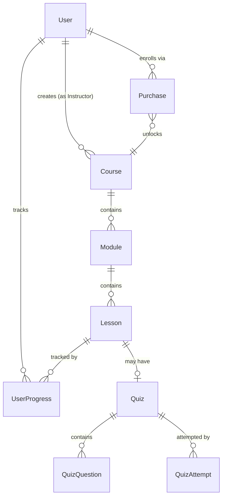
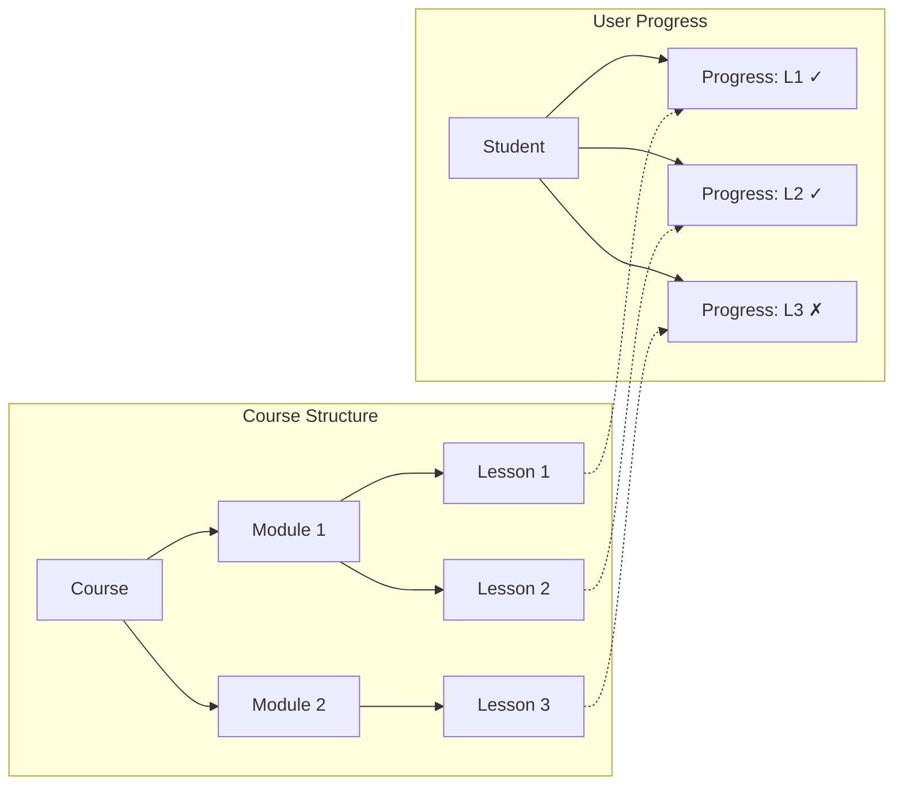

# LMS Database Schema Documentation

> **Technical Reference Guide**  
> Version: 1.0 | Last Updated: January 2026  
> Stack: Express.js + PostgreSQL + Prisma ORM

---

## Table of Contents

1. [Entity Relationship Overview](#1-entity-relationship-overview)
2. [Detailed Model Dictionary](#2-detailed-model-dictionary)
3. [Feature Implementation Guide](#3-feature-implementation-guide)
4. [Prisma Specifics](#4-prisma-specifics)

---

## 1. Entity Relationship Overview

### 1.1 Core Hierarchy

The LMS follows a strict hierarchical structure for course content:



**Flow Explanation:**

| Level | Model | Purpose |
|-------|-------|---------|
| 1 | `User` | The actor (Admin, Instructor, or Student) |
| 2 | `Course` | A complete learning package created by an Instructor |
| 3 | `Module` | Chapters/sections within a course (e.g., "Week 1", "Introduction") |
| 4 | `Lesson` | Individual content pieces (Video, Text, or Quiz) |
| 5 | `Quiz` | Assessment attached to a QUIZ-type lesson |

### 1.2 Student Enrollment Flow

The enrollment system uses a **Purchase-based model** rather than a simple join table. This design captures transactional data for revenue analytics.

```
Student wants to access Course
        │
        ▼
┌───────────────────┐
│   Purchase Table  │  ◄── Records: userId, courseId, price, paymentId
└───────────────────┘
        │
        ▼
Student can now access all Modules & Lessons
        │
        ▼
┌───────────────────┐
│  UserProgress     │  ◄── Tracks: which lessons are completed
└───────────────────┘
```

**Key Points:**
- `Purchase` acts as the **enrollment record** AND the **transaction record**
- A student can only have ONE purchase per course (`@@unique([userId, courseId])`)
- Progress is tracked per-lesson, not per-module or per-course

### 1.3 Progress Tracking Relationship



**Calculation Logic:**
- Total lessons in course = 3
- Completed lessons (isCompleted = true) = 2
- **Progress = 2/3 = 66.67%**

---

## 2. Detailed Model Dictionary

### 2.1 User & Authentication

#### `User`

| Aspect | Details |
|--------|---------|
| **Purpose** | Central identity table for all system actors |
| **Table Name** | `users` |

**Key Fields:**

| Field | Type | Description |
|-------|------|-------------|
| `role` | `Role` Enum | Distinguishes user type: `ADMIN`, `INSTRUCTOR`, `STUDENT` |
| `passwordHash` | `String` | Bcrypt-hashed password (NEVER store plain text) |
| `isActive` | `Boolean` | Soft-delete flag. Set to `false` to disable account |
| `isVerified` | `Boolean` | Email verification status |
| `lastLoginAt` | `DateTime?` | Tracks last login for security/analytics |

**Relations Explained:**

```typescript
// One-to-One: Only instructors have profiles
instructorProfile InstructorProfile?

// One-to-Many: An instructor can create many courses
courses Course[] @relation("InstructorCourses")

// One-to-Many: A student can purchase many courses
purchases Purchase[]

// One-to-Many: A student tracks progress across many lessons
userProgress UserProgress[]
```

---

#### `InstructorProfile`

| Aspect | Details |
|--------|---------|
| **Purpose** | Extended profile data for instructors only |
| **Table Name** | `instructor_profiles` |
| **Why Separate?** | Not all users are instructors. This avoids NULL columns in the User table |

**Key Fields:**

| Field | Type | Description |
|-------|------|-------------|
| `expertise` | `String[]` | PostgreSQL array for tags like `["JavaScript", "React", "Node.js"]` |
| `socialLinks` | `Json?` | Flexible structure: `{ twitter: "url", linkedin: "url" }` |
| `totalStudents` | `Int` | **Denormalized counter** for fast dashboard reads |
| `totalRevenue` | `Decimal` | **Denormalized counter** - update via triggers or application logic |
| `averageRating` | `Float` | **Denormalized** - recalculate when reviews change |

**Why `onDelete: Cascade`?**
```prisma
user User @relation(fields: [userId], references: [id], onDelete: Cascade)
```
If a User is deleted, their InstructorProfile is automatically deleted. This maintains referential integrity without orphan records.

---

### 2.2 Course Architecture

#### `Category`

| Aspect | Details |
|--------|---------|
| **Purpose** | Organize courses into browsable categories |
| **Table Name** | `categories` |
| **Special Feature** | Self-referencing for nested categories |

**Key Fields:**

| Field | Type | Description |
|-------|------|-------------|
| `slug` | `String` | URL-friendly identifier: `"web-development"` |
| `parentId` | `Int?` | Self-reference for hierarchy (NULL = top-level) |
| `position` | `Int` | Display order within parent |

**Self-Relation Pattern:**
```prisma
parent   Category?  @relation("CategoryHierarchy", fields: [parentId], references: [id], onDelete: SetNull)
children Category[] @relation("CategoryHierarchy")
```

**Example Hierarchy:**
```
Programming (parentId: null)
├── Web Development (parentId: 1)
│   ├── Frontend (parentId: 2)
│   └── Backend (parentId: 2)
└── Mobile Development (parentId: 1)
```

**Why `onDelete: SetNull`?** If a parent category is deleted, children become top-level categories instead of being deleted.

---

#### `Course`

| Aspect | Details |
|--------|---------|
| **Purpose** | The main product - a complete learning package |
| **Table Name** | `courses` |

**Key Fields:**

| Field | Type | Description |
|-------|------|-------------|
| `slug` | `String` | URL path: `/courses/react-masterclass` |
| `status` | `CourseStatus` | Workflow state: `DRAFT` → `PENDING_REVIEW` → `PUBLISHED` → `ARCHIVED` |
| `level` | `CourseLevel` | Difficulty: `BEGINNER`, `INTERMEDIATE`, `ADVANCED`, `ALL_LEVELS` |
| `price` | `Decimal(10,2)` | Course price with 2 decimal precision |
| `discountPrice` | `Decimal?` | Sale price (NULL = no discount) |
| `requirements` | `String[]` | Prerequisites: `["Basic JavaScript", "HTML/CSS"]` |
| `whatYouWillLearn` | `String[]` | Learning outcomes for course page |
| `totalDuration` | `Int` | **Denormalized** - sum of all lesson durations (seconds) |
| `totalStudents` | `Int` | **Denormalized** - count of purchases |
| `isFeatured` | `Boolean` | For homepage/marketing highlights |

**Status Enum Workflow:**
```
DRAFT ──────► PENDING_REVIEW ──────► PUBLISHED
  │                                      │
  │                                      ▼
  └──────────────────────────────► ARCHIVED
```

**Why `onDelete: Cascade` on instructor?**
```prisma
instructor User @relation("InstructorCourses", fields: [instructorId], references: [id], onDelete: Cascade)
```
If an instructor account is deleted, all their courses are deleted. This is a business decision - adjust to `SetNull` if you want to preserve courses.

---

#### `Module`

| Aspect | Details |
|--------|---------|
| **Purpose** | Chapters/sections within a course |
| **Table Name** | `modules` |

**Key Fields:**

| Field | Type | Description |
|-------|------|-------------|
| `position` | `Int` | Order within course (0, 1, 2, ...) |
| `isPublished` | `Boolean` | Draft modules are hidden from students |

**Example Structure:**
```
Course: "React Masterclass"
├── Module 1 (position: 0): "Getting Started"
├── Module 2 (position: 1): "Components & Props"
├── Module 3 (position: 2): "State Management"
└── Module 4 (position: 3): "Advanced Patterns"
```

---

#### `Lesson`

| Aspect | Details |
|--------|---------|
| **Purpose** | Individual content pieces within modules |
| **Table Name** | `lessons` |

**Key Fields:**

| Field | Type | Description |
|-------|------|-------------|
| `type` | `LessonType` | Content format: `VIDEO`, `TEXT`, or `QUIZ` |
| `content` | `Text?` | Markdown/HTML for TEXT lessons (NULL for VIDEO/QUIZ) |
| `videoUrl` | `String?` | Video URL for VIDEO lessons |
| `duration` | `Int` | Length in seconds |
| `position` | `Int` | Order within module |
| `isFree` | `Boolean` | Preview lessons accessible without purchase |
| `isPublished` | `Boolean` | Visibility control |

**Type-Specific Usage:**

| LessonType | Uses `content` | Uses `videoUrl` | Uses `quiz` relation |
|------------|----------------|-----------------|---------------------|
| `VIDEO` | ✗ | ✓ | ✗ |
| `TEXT` | ✓ | ✗ | ✗ |
| `QUIZ` | ✗ | ✗ | ✓ |

---

#### `MuxData`

| Aspect | Details |
|--------|---------|
| **Purpose** | Store Mux.com video streaming metadata |
| **Table Name** | `mux_data` |
| **Why Separate?** | Isolates third-party integration data from core lesson model |

**Key Fields:**

| Field | Type | Description |
|-------|------|-------------|
| `assetId` | `String` | Mux asset identifier |
| `playbackId` | `String?` | Used to construct streaming URL |
| `status` | `String?` | Processing status: `"preparing"`, `"ready"`, `"errored"` |

---

#### `Attachment`

| Aspect | Details |
|--------|---------|
| **Purpose** | Downloadable resources for a course |
| **Table Name** | `attachments` |

**Key Fields:**

| Field | Type | Description |
|-------|------|-------------|
| `url` | `String` | Download URL (S3, CloudFlare, etc.) |
| `size` | `Int?` | File size in bytes for UI display |
| `mimeType` | `String?` | File type: `"application/pdf"`, `"image/png"` |
| `position` | `Int` | Display order |

---

### 2.3 Quiz System

#### `Quiz`

| Aspect | Details |
|--------|---------|
| **Purpose** | Assessment configuration for QUIZ-type lessons |
| **Table Name** | `quizzes` |
| **Relationship** | One-to-One with Lesson (`lessonId` is `@unique`) |

**Key Fields:**

| Field | Type | Description |
|-------|------|-------------|
| `passingScore` | `Int` | Minimum % to pass (default: 70) |
| `timeLimitMinutes` | `Int?` | NULL = unlimited time |
| `allowRetake` | `Boolean` | Can student retry after failing? |
| `maxAttempts` | `Int?` | NULL = unlimited attempts |
| `shuffleQuestions` | `Boolean` | Randomize question order each attempt |

---

#### `QuizQuestion`

| Aspect | Details |
|--------|---------|
| **Purpose** | Individual questions within a quiz |
| **Table Name** | `quiz_questions` |

**Key Fields:**

| Field | Type | Description |
|-------|------|-------------|
| `question` | `Text` | The question text |
| `options` | `Json` | Flexible options structure (see below) |
| `explanation` | `Text?` | Shown after answering (for learning) |
| `points` | `Int` | Point value (default: 1) |
| `position` | `Int` | Question order |

**Options JSON Structure:**
```json
[
  { "id": "a", "text": "JavaScript", "isCorrect": false },
  { "id": "b", "text": "TypeScript", "isCorrect": true },
  { "id": "c", "text": "CoffeeScript", "isCorrect": false },
  { "id": "d", "text": "ActionScript", "isCorrect": false }
]
```

> **Why JSON instead of a separate table?**  
> Options are tightly coupled to questions and rarely queried independently. JSON simplifies the data model and improves read performance for quiz rendering.

---

#### `QuizAttempt`

| Aspect | Details |
|--------|---------|
| **Purpose** | Record of a student taking a quiz |
| **Table Name** | `quiz_attempts` |

**Key Fields:**

| Field | Type | Description |
|-------|------|-------------|
| `score` | `Int` | Points earned |
| `totalPoints` | `Int` | Maximum possible points |
| `percentage` | `Float` | Calculated: `(score / totalPoints) * 100` |
| `isPassed` | `Boolean` | `percentage >= quiz.passingScore` |
| `startedAt` | `DateTime` | When attempt began |
| `completedAt` | `DateTime?` | NULL = in progress |
| `timeTaken` | `Int?` | Duration in seconds |

---

#### `QuizAttemptAnswer`

| Aspect | Details |
|--------|---------|
| **Purpose** | Individual answer within an attempt |
| **Table Name** | `quiz_attempt_answers` |

**Key Fields:**

| Field | Type | Description |
|-------|------|-------------|
| `selectedOption` | `String` | The option ID selected (e.g., `"b"`) |
| `isCorrect` | `Boolean` | Was the answer correct? |
| `pointsEarned` | `Int` | Points for this answer |

---

### 2.4 Student Engagement

#### `Purchase`

| Aspect | Details |
|--------|---------|
| **Purpose** | Enrollment record + transaction record |
| **Table Name** | `purchases` |

**Key Fields:**

| Field | Type | Description |
|-------|------|-------------|
| `price` | `Decimal(10,2)` | Actual price paid (may differ from course price) |
| `currency` | `String` | ISO code: `"USD"`, `"EUR"`, `"IDR"` |
| `paymentMethod` | `String?` | `"stripe"`, `"paypal"`, `"manual"` |
| `paymentId` | `String?` | External reference (Stripe PaymentIntent ID, etc.) |
| `status` | `String` | `"pending"`, `"completed"`, `"refunded"` |
| `refundedAt` | `DateTime?` | When refund was processed |

**Why `@@unique([userId, courseId])`?**
A student can only purchase a course once. This prevents duplicate enrollments and simplifies access checks.

---

#### `UserProgress`

| Aspect | Details |
|--------|---------|
| **Purpose** | Track student progress through lessons |
| **Table Name** | `user_progress` |

**Key Fields:**

| Field | Type | Description |
|-------|------|-------------|
| `isCompleted` | `Boolean` | Has lesson been fully completed? |
| `watchTime` | `Int` | Seconds watched (for video analytics) |
| `completedAt` | `DateTime?` | Timestamp of completion |

**Why `@@unique([userId, lessonId])`?**
One progress record per student per lesson. Use `upsert` to create-or-update.

---

#### `Review`

| Aspect | Details |
|--------|---------|
| **Purpose** | Student ratings and feedback |
| **Table Name** | `reviews` |

**Key Fields:**

| Field | Type | Description |
|-------|------|-------------|
| `rating` | `Int` | 1-5 stars |
| `title` | `String?` | Short summary |
| `comment` | `Text?` | Detailed feedback |
| `isVisible` | `Boolean` | Moderation flag (hide inappropriate reviews) |

**Why `@@unique([userId, courseId])`?**
One review per student per course. To update, use `upsert`.

---

### 2.5 System

#### `Notification`

| Aspect | Details |
|--------|---------|
| **Purpose** | In-app notifications |
| **Table Name** | `notifications` |

**Key Fields:**

| Field | Type | Description |
|-------|------|-------------|
| `type` | `String` | Category: `"course_update"`, `"new_lesson"`, `"quiz_result"`, `"system"` |
| `data` | `Json?` | Contextual payload: `{ courseId: 5, lessonId: 12 }` |
| `isRead` | `Boolean` | Read/unread status |

---

#### `SystemSetting`

| Aspect | Details |
|--------|---------|
| **Purpose** | Key-value store for app configuration |
| **Table Name** | `system_settings` |

**Example Usage:**
```json
{ "key": "platform_fee_percentage", "value": 10 }
{ "key": "featured_course_ids", "value": [1, 5, 12] }
{ "key": "maintenance_mode", "value": false }
```

---

## 3. Feature Implementation Guide

### 3.1 Ordering Modules & Lessons

Both `Module` and `Lesson` have a `position` field for ordering.

**Query modules in order:**
```typescript
const modules = await prisma.module.findMany({
  where: { courseId: 5 },
  orderBy: { position: 'asc' },
  include: {
    lessons: {
      orderBy: { position: 'asc' }
    }
  }
});
```

**Reordering (drag-and-drop):**
```typescript
// Update positions in bulk
await prisma.$transaction(
  newOrder.map((id, index) =>
    prisma.module.update({
      where: { id },
      data: { position: index }
    })
  )
);
```

**Best Practice:** Use gaps in positions (0, 10, 20) to allow insertions without reordering everything.

---

### 3.2 Progress Calculation

To calculate the "40% Completed" dashboard stat:

```typescript
async function getCourseProgress(userId: number, courseId: number) {
  // Get total lesson count for the course
  const totalLessons = await prisma.lesson.count({
    where: {
      module: { courseId },
      isPublished: true
    }
  });

  // Get completed lesson count for this user
  const completedLessons = await prisma.userProgress.count({
    where: {
      userId,
      isCompleted: true,
      lesson: {
        module: { courseId },
        isPublished: true
      }
    }
  });

  const percentage = totalLessons > 0 
    ? Math.round((completedLessons / totalLessons) * 100) 
    : 0;

  return { totalLessons, completedLessons, percentage };
}
```

**Alternative: Single Query with Aggregation**
```typescript
const result = await prisma.lesson.findMany({
  where: {
    module: { courseId },
    isPublished: true
  },
  select: {
    id: true,
    userProgress: {
      where: { userId, isCompleted: true },
      select: { id: true }
    }
  }
});

const total = result.length;
const completed = result.filter(l => l.userProgress.length > 0).length;
const percentage = Math.round((completed / total) * 100);
```

---

### 3.3 Role Management

The `Role` enum provides three distinct user types:

```typescript
// Middleware example
function requireRole(...roles: Role[]) {
  return (req, res, next) => {
    if (!roles.includes(req.user.role)) {
      return res.status(403).json({ error: 'Forbidden' });
    }
    next();
  };
}

// Usage
router.get('/admin/users', requireRole('ADMIN'), getUsers);
router.post('/courses', requireRole('INSTRUCTOR', 'ADMIN'), createCourse);
router.post('/enroll', requireRole('STUDENT'), enrollCourse);
```

**Role-Based Access Matrix:**

| Feature | ADMIN | INSTRUCTOR | STUDENT |
|---------|-------|------------|---------|
| Manage all users | ✓ | ✗ | ✗ |
| Create courses | ✓ | ✓ | ✗ |
| Edit own courses | ✓ | ✓ | ✗ |
| View all courses | ✓ | ✗ | ✗ |
| Purchase courses | ✗ | ✗ | ✓ |
| Track progress | ✗ | ✗ | ✓ |
| Leave reviews | ✗ | ✗ | ✓ |

**Checking Course Ownership:**
```typescript
async function canEditCourse(userId: number, courseId: number, role: Role) {
  if (role === 'ADMIN') return true;
  
  const course = await prisma.course.findUnique({
    where: { id: courseId },
    select: { instructorId: true }
  });
  
  return course?.instructorId === userId;
}
```

---

### 3.4 Dashboard Analytics Queries

#### Total Students per Course (Instructor Dashboard)
```typescript
const courseStats = await prisma.course.findMany({
  where: { instructorId: userId },
  select: {
    id: true,
    title: true,
    totalStudents: true, // Denormalized field
    _count: {
      select: { purchases: true } // Or count dynamically
    }
  }
});
```

#### Total Revenue (Instructor Dashboard)
```typescript
const revenue = await prisma.purchase.aggregate({
  where: {
    course: { instructorId: userId },
    status: 'completed'
  },
  _sum: { price: true }
});

console.log(revenue._sum.price); // Decimal
```

#### Revenue by Month (Chart Data)
```typescript
const monthlyRevenue = await prisma.$queryRaw`
  SELECT 
    DATE_TRUNC('month', created_at) as month,
    SUM(price) as total
  FROM purchases
  WHERE course_id IN (
    SELECT id FROM courses WHERE instructor_id = ${userId}
  )
  AND status = 'completed'
  GROUP BY DATE_TRUNC('month', created_at)
  ORDER BY month DESC
  LIMIT 12
`;
```

#### Course Completion Rates
```typescript
async function getCompletionRate(courseId: number) {
  const totalLessons = await prisma.lesson.count({
    where: { module: { courseId }, isPublished: true }
  });

  const studentsWithProgress = await prisma.purchase.findMany({
    where: { courseId },
    select: {
      userId: true,
      user: {
        select: {
          userProgress: {
            where: {
              isCompleted: true,
              lesson: { module: { courseId } }
            }
          }
        }
      }
    }
  });

  const completionRates = studentsWithProgress.map(s => ({
    userId: s.userId,
    percentage: Math.round((s.user.userProgress.length / totalLessons) * 100)
  }));

  const avgCompletion = completionRates.reduce((sum, s) => sum + s.percentage, 0) 
    / completionRates.length || 0;

  return { totalStudents: completionRates.length, avgCompletion };
}
```

---

## 4. Prisma Specifics

### 4.1 `@relation` Directive

Defines how models connect. Essential for Prisma's type-safe includes.

```prisma
// Named relation (required when multiple relations exist between same models)
courses Course[] @relation("InstructorCourses")

// Standard relation with cascade
course Course @relation(fields: [courseId], references: [id], onDelete: Cascade)
```

**`onDelete` Options:**

| Option | Behavior |
|--------|----------|
| `Cascade` | Delete related records when parent is deleted |
| `SetNull` | Set foreign key to NULL (field must be optional) |
| `Restrict` | Prevent deletion if related records exist |
| `NoAction` | Database default (usually same as Restrict) |

---

### 4.2 `@@index` Directive

Creates database indexes for faster queries.

```prisma
@@index([courseId])           // Single column index
@@index([userId, quizId])     // Composite index
@@index([status, createdAt])  // For filtered + sorted queries
```

**When to Add Indexes:**
- Foreign keys (Prisma doesn't auto-index these in PostgreSQL)
- Fields used in `WHERE` clauses
- Fields used in `ORDER BY`
- Fields used in `JOIN` conditions

**Indexes in This Schema:**

| Table | Index | Purpose |
|-------|-------|---------|
| `users` | `email` | Login lookup |
| `users` | `role` | Role-based filtering |
| `courses` | `slug` | SEO URL lookup |
| `courses` | `status` | Filter by publication state |
| `courses` | `isFeatured` | Homepage queries |
| `purchases` | `createdAt` | Revenue time-series |
| `user_progress` | `isCompleted` | Progress calculations |

---

### 4.3 `@@unique` Directive

Enforces uniqueness at database level and enables `upsert` operations.

```prisma
@@unique([userId, courseId])  // Composite unique constraint
```

**Usage with Upsert:**
```typescript
await prisma.userProgress.upsert({
  where: {
    userId_lessonId: { userId: 1, lessonId: 5 }  // Auto-generated name
  },
  update: { isCompleted: true, completedAt: new Date() },
  create: { userId: 1, lessonId: 5, isCompleted: true, completedAt: new Date() }
});
```

---

### 4.4 `@map` and `@@map` Directives

Controls database naming while keeping Prisma models TypeScript-friendly.

```prisma
firstName String @map("first_name")  // Column: first_name, Field: firstName
@@map("users")                        // Table: users, Model: User
```

**Benefits:**
- Database uses `snake_case` (PostgreSQL convention)
- TypeScript uses `camelCase` (JavaScript convention)
- Clean API responses without transformation

---

### 4.5 `@db` Directive

Specifies PostgreSQL-specific column types.

```prisma
bio         String?  @db.Text          // TEXT instead of VARCHAR
price       Decimal  @db.Decimal(10,2) // DECIMAL(10,2) for money
totalRevenue Decimal @db.Decimal(12,2) // Larger precision for totals
```

**PostgreSQL Type Mapping:**

| Prisma | Default PG Type | With @db |
|--------|-----------------|----------|
| `String` | `VARCHAR(191)` | `@db.Text` → `TEXT` |
| `Decimal` | `DECIMAL(65,30)` | `@db.Decimal(10,2)` → `DECIMAL(10,2)` |
| `String[]` | `TEXT[]` | Native PostgreSQL array |

---

### 4.6 JSON Fields

Prisma maps `Json` type to PostgreSQL's `JSONB`.

```prisma
options     Json    // Quiz options
socialLinks Json?   // Instructor social media
data        Json?   // Notification metadata
```

**Querying JSON:**
```typescript
// Filter by JSON field (PostgreSQL)
const questions = await prisma.$queryRaw`
  SELECT * FROM quiz_questions 
  WHERE options @> '[{"isCorrect": true}]'
`;
```

---

### 4.7 Array Fields

PostgreSQL-native arrays for simple lists.

```prisma
expertise        String[]   // ["React", "Node.js"]
requirements     String[]   // ["Basic JS knowledge"]
whatYouWillLearn String[]   // Learning outcomes
```

**Querying Arrays:**
```typescript
// Contains value
const courses = await prisma.course.findMany({
  where: {
    requirements: { has: 'JavaScript' }
  }
});

// Contains any of values
const instructors = await prisma.instructorProfile.findMany({
  where: {
    expertise: { hasSome: ['React', 'Vue'] }
  }
});
```

---

## Quick Reference: Prisma Query Patterns

### Enrollment Check
```typescript
const isEnrolled = await prisma.purchase.findUnique({
  where: { userId_courseId: { userId, courseId } }
}) !== null;
```

### Create Course with Modules
```typescript
const course = await prisma.course.create({
  data: {
    title: 'React Masterclass',
    slug: 'react-masterclass',
    instructorId: userId,
    modules: {
      create: [
        { title: 'Introduction', position: 0 },
        { title: 'Components', position: 1 }
      ]
    }
  },
  include: { modules: true }
});
```

### Update Denormalized Counters
```typescript
// After new purchase
await prisma.$transaction([
  prisma.purchase.create({ data: { userId, courseId, price } }),
  prisma.course.update({
    where: { id: courseId },
    data: { totalStudents: { increment: 1 } }
  }),
  prisma.instructorProfile.update({
    where: { userId: instructorId },
    data: { 
      totalStudents: { increment: 1 },
      totalRevenue: { increment: price }
    }
  })
]);
```

---

## Conclusion

This schema is designed for:

1. **Scalability** - Proper indexes and denormalized counters for analytics
2. **Flexibility** - JSON fields for variable data structures
3. **Integrity** - Cascading deletes and unique constraints
4. **Developer Experience** - Clean Prisma models with PostgreSQL naming conventions

For questions or schema modifications, consider the tradeoffs between normalization (data integrity) and denormalization (query performance).
